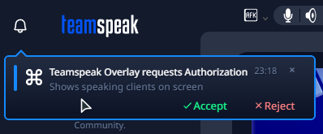
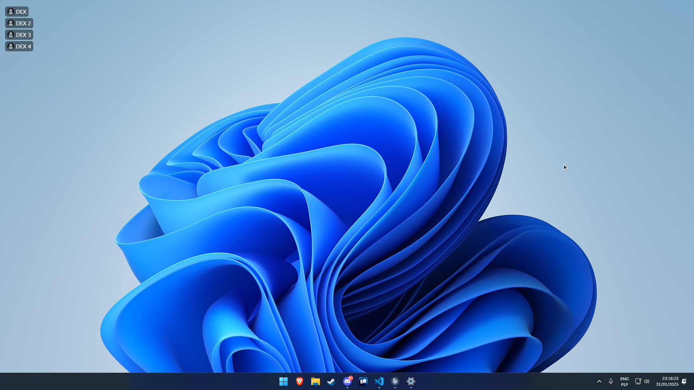

# Info

Simple screen overlay that shows speaking users from the current channel in the upper left corner of the screen.
Currently, in progress of a full rewrite of the app using C++ and Qt6.

## Installation

1. Download the latest version from the [releases page](https://github.com/PandaDex/TeamSpeak-6-Overlay/releases).
2. Run the installer.
3. After installation, accept the connection request in the TeamSpeak client.  
   

# TODO

Fields with \* are required for me to count this as a stable release

- [x] polish websocket code. \*
- [x] More error handling so the app won't crash so often. \*
- [x] Code optimizations and cleanup. \*
- [x] Installer (99% NSIS) \*
- [x] Achieve the same functionality as an electron version. \*
- [ ] Different way to store config.
- [ ] Translations currently planned are: Polish, German, Russian, Turkish and Czech

## Issues and Feature Requests

If you have any issues, bugs or feature requests, please create an issue on the [issues page](https://github.com/PandaDex/TeamSpeak-6-Overlay/issues).

# Why the rewrite and Qt6

I decided to rewrite it for two main reasons:

- **Performance** – Electron is great for full desktop apps, but memory usage is brutal. This overlay used around 150 MB of RAM, while the Qt6 version uses around 50 MB.
- **Maintainability** – This project wasn’t originally meant to become what it is. I started working on the overlay for fun, because when me and my friends switched from Discord to TeamSpeak 6, I missed that feature. I didn’t care if something was done well or if it was throwing a bunch of errors, I just wanted a simple app to see who joined voice chat or who was currently talking. So there’s a lot that needs fixing and rethinking. Even if I stay with Electron, I would still have to rewrite the app.

## Screenshots

