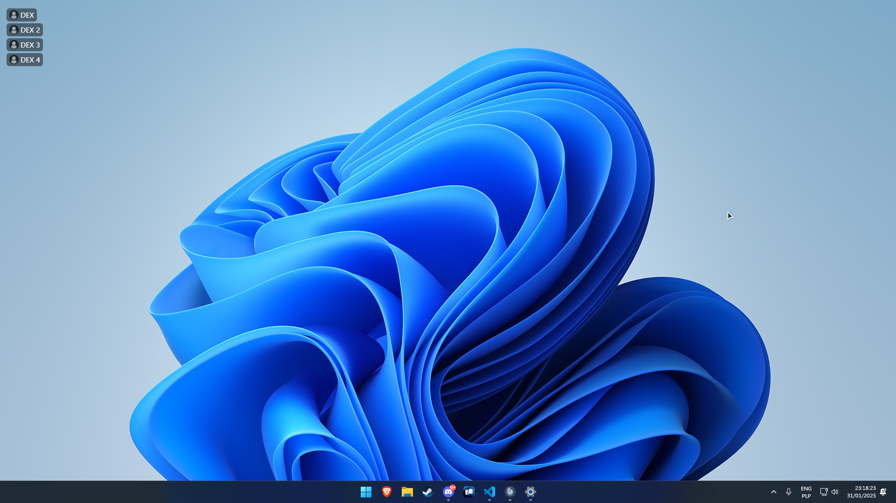

# TeamSpeak 5/6 Overlay

Simple screen overlay that shows speaking users from the current channel in the upper left corner of the screen (customization coming soon).

## Compatibility

```
⚠️ Supports only windowed and fullscreen borderless applications, won't work with exclusive fullscreen applications.
```

## Installation

1. Download the latest version from the [releases page](https://github.com/PandaDex/TeamSpeak-6-Overlay/releases).
2. Run the installer.
3. After installation, accept the connection request in the TeamSpeak client. <br>
   

## Future Plans

- Add an option to select whether to show only speaking users or all users and highlight speaking users.
- Overlay position change.
- Overlay transparency.
- Add a way to start the overlay automatically with the TeamSpeak client.

## Issues and Feature Requests

If you have any issues,bugs or feature requests, please create an issue on the [issues page](https://github.com/PandaDex/TeamSpeak-6-Overlay/issues).

## Screenshots



