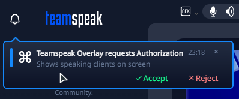

# TeamSpeak 5/6 Overlay
 
 Simple screen overlay that shows speaking users from the current channel in the upper left corner of the screen (customization coming soon).

# Sorry for low activity

Hey, sorry for not being very active on this project, this is a side project for me as i have 2 major projects in the making and work in meantime. I will continue to maintain this repo but expect commits only every few days.

## Upcoming update

You can test new update by downloading pre-release version from [releases](https://github.com/PandaDex/TeamSpeak-6-Overlay/releases)

## Compatibility

- Supports only windowed and fullscreen borderless applications, won’t work with exclusive fullscreen applications.
- Shouldn’t interfere with any anti-cheat software but i can’t guarantee anything.
- Currently it supports Windows, but I’m in the making of a new release that will support Linux.

## Installation

1. Download the latest version from the [releases page](https://github.com/PandaDex/TeamSpeak-6-Overlay/releases).
2. Run the installer.
3. After installation, accept the connection request in the TeamSpeak client.  
   
4. Create shortcut to main executable and put it in `shell:startup` folder. (Optional)

## Future Plans

- Add an option to select whether to show only speaking users or all users and highlight speaking users.
- Add a way to start the overlay automatically with the TeamSpeak client.
- Linux And MacOS(maybe) Support.

## Issues and Feature Requests

If you have any issues,bugs or feature requests, please create an issue on the [issues page](https://github.com/PandaDex/TeamSpeak-6-Overlay/issues).

## Screenshots

